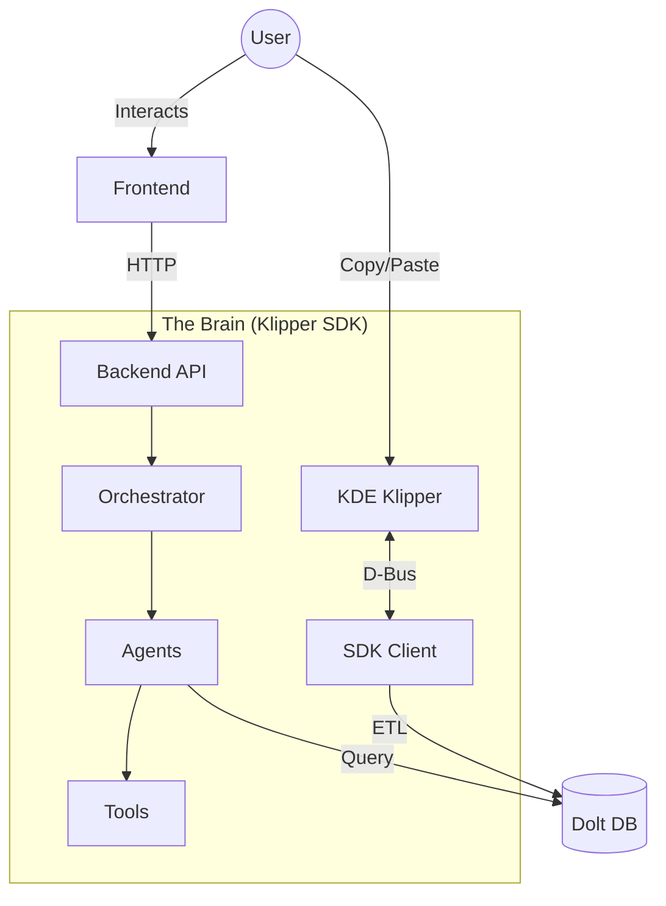

# Project T180: The Meta-AI Workspace

> **Hyper View Manifest**: This workspace represents the convergence of desktop interaction, structured memory, and autonomous agency. It is the proving ground for the **Klipper SDK** and its evolution into a Meta-AI Orchestrator.

## 🌌 Vision

**Project T180** is not just a collection of tools; it is a **Cognitive Operating Environment**. By bridging the gap between ephemeral user actions (clipboard, shell) and structured long-term memory (SQL), it enables AI agents to observe, learn, and eventually predict user intent.

The core philosophy is built on **Five Generations** of evolution:
1.  **Interop**: Connecting to the OS (Clipboard/D-Bus).
2.  **Observation**: Structuring raw data into patterns.
3.  **Capability**: Defining tools for agents to act.
4.  **Agency**: creating specialized personas (Planner, Coder, Analyst).
5.  **Orchestration**: Meta-cognitive management of multi-agent workflows.

---

## 🏛 Architecture Map

The workspace is divided into four distinct planes of existence:

| Plane | Component | Description | Technology |
| :--- | :--- | :--- | :--- |
| **The Brain** | [`klipper_sdk`](./klipper_sdk/README.md) | The core intelligence library. Handles ETL, Agent logic, and Orchestration. | Python 3.8+ |
| **The API** | [`backend`](./backend) | The nervous system. Exposes "The Brain" to the outside world via REST endpoints. | FastAPI |
| **The Face** | [`frontend`](./frontend/README.md) | The user interface. Visualizes thought processes, plans, and memory. | React + Vite |
| **The Memory** | [`db`](./db) | The hippocampus. Stores structured history and learned patterns. | Dolt / MySQL |



---

## 🧭 The Five Generations

This project is currently transitioning from **Generation 2** (Observation) to **Generation 5** (Orchestration).

*   **Gen 1 (Foundation)**: Raw access to Klipper history. [✅ DONE]
*   **Gen 2 (Observer)**: Star-rating logic, frequency analysis, and basic ETL. [✅ DONE]
*   **Gen 3 (Tools)**: Standardized tool interfaces for code execution and file IO. [✅ DONE]
*   **Gen 4 (Agents)**: Role-based execution (e.g., "The Analyst" vs "The Coder"). [✅ DONE]
*   **Gen 5 (Orchestrator)**: `KickLang` blueprint execution and dynamic workflow adaptation. [🚧 IN PROGRESS]

---

## 🚀 Global Quick Start

To bring the entire system online:

### 1. Initialize Memory
Ensure your database is running and accessible (default port 3306).
```bash
# (Optional) Navigate to db to handle schema
cd db
# See db/README.md for Dolt setup instructions
```

### 2. Awaken the Brain (Backend)
Start the FastAPI server to expose the SDK capabilities.
```bash
cd backend
pip install -r requirements.txt
python main.py
```
*Server will listen on `http://localhost:4448`*

### 3. Open the Eyes (Frontend)
Launch the dashboard to interact with the system.
```bash
cd frontend
npm install
npm run dev
```
*UI will be available at `http://localhost:5173`*

---

> *"The goal is not just to automate the task, but to understand the intent behind it."*
